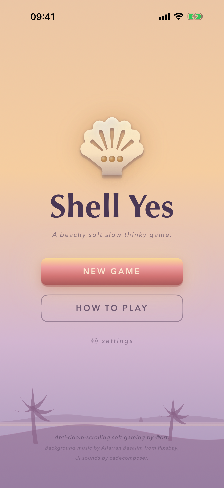
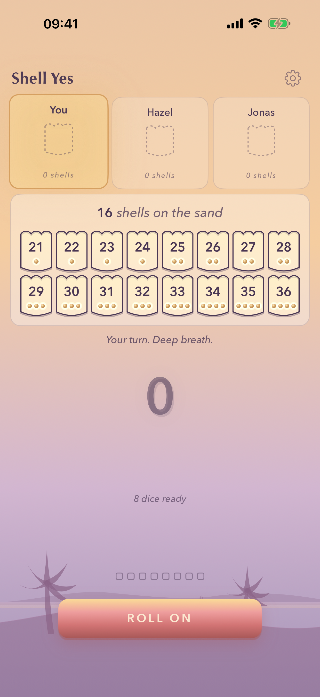
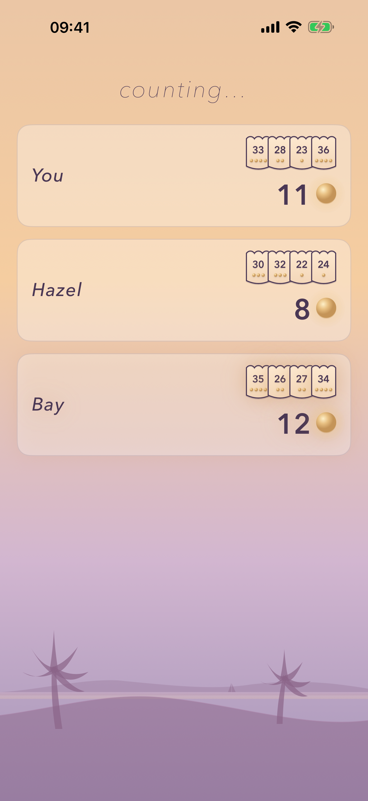

# Shell Yes

A push-your-luck dice game for iPhone. Roll eight dice, keep pearls, claim shells off the sand. Land on a rival's exact number and the shell is yours. Push too far and the tide takes it back.

Mechanics inspired by Regenwormen/Heckmeck, reskinned with an original name and theme.

| Splash | Board | Tally |
| --- | --- | --- |
|  |  |  |

## Repo layout

```
ios/ShellYes/          SwiftUI app, the shipping game
ios/ShellYesEngine/    Swift package: pure engine + AI, no UI
src/                   TypeScript engine, AI, and terminal client (the original prototype)
parity/                trace-diff harness asserting the TS and Swift engines agree
tests/  sim/           vitest suites and the AI-vs-AI regression
```

## Build and run

Xcode 26, iOS 18 minimum, iPhone only.

```
open ios/ShellYes/ShellYes.xcodeproj
```

Scheme `ShellYes`, any iPhone simulator, Run. From the command line:

```
xcodebuild -scheme ShellYes -destination 'platform=iOS Simulator,name=iPhone 17' build
```

## Tests

```
swift test --package-path ios/ShellYesEngine                                    # engine + AI
xcodebuild test -scheme ShellYes -destination 'platform=iOS Simulator,name=iPhone 17' \
  -only-testing:ShellYesTests                                                   # app unit tests
npm test                                                                        # TypeScript engine, AI, renderer, net
npm run sim                                                                     # 200-game AI-vs-AI regression
node parity/diff.mjs                                                            # TS vs Swift engine trace parity
```

The regression sim asserts a higher-discipline AI beats a lower-discipline one over the sample, so the difficulty tiers are never cosmetic.

## How a turn works

1. Roll the eight dice in your hand.
2. Keep every die of one face value. That face is spent, you can't keep it again this turn.
3. Re-roll what's left, or stop and claim.
4. To claim, your kept dice must include at least one pearl (the pearl face is worth 5). Your sum takes the highest shell on the sand at or below it, or steals a rival's top shell on an exact match.
5. **Bust** if a roll lands no new face, if you stop without a pearl, or if no shell fits. Your top shell goes back and the highest shell on the sand burns for good.

Shells are numbered 21-36 and worth 1 to 4 pearls each. When the sand empties, most pearls wins.

## Architecture

One rule, and it's the reason a second platform is a port rather than a rewrite: **the engine is pure**.

```
ios/ShellYesEngine/Engine.swift   (state, action, rng) -> newState
ios/ShellYesEngine/AI.swift       depends only on the engine
ios/ShellYes/*.swift              SwiftUI shell: rendering, audio, telemetry
```

- No I/O, no `Date`, no `Math.random`/`SystemRandomNumberGenerator` inside the engine or the AI. Every die flows through an injected `rng`, so a server can own the rolls in multiplayer without touching game logic.
- AI difficulty is a single `discipline` knob. Higher is harder: it stops earlier and banks any reachable shell.
- The same shape holds on the TypeScript side (`src/engine.ts`, `src/ai.ts`), and `parity/` keeps the two engines honest by diffing state traces case by case.

## Terminal build

The original prototype still runs, including its LAN multiplayer daemon. See [docs/terminal.md](docs/terminal.md).

## Tech

SwiftUI for the app (Swift 5 language mode, swift-tools 5.9 for the engine package). TypeScript strict, vitest, tsx for the prototype. Both engines are framework-free and dependency-free.
